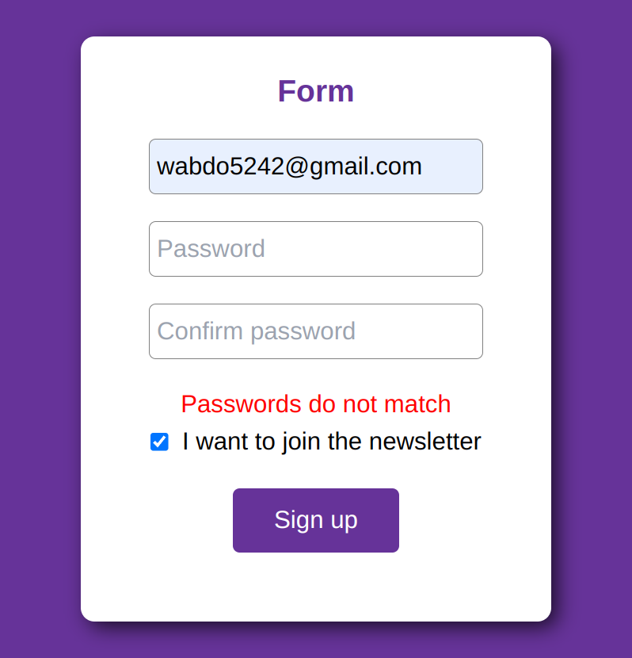
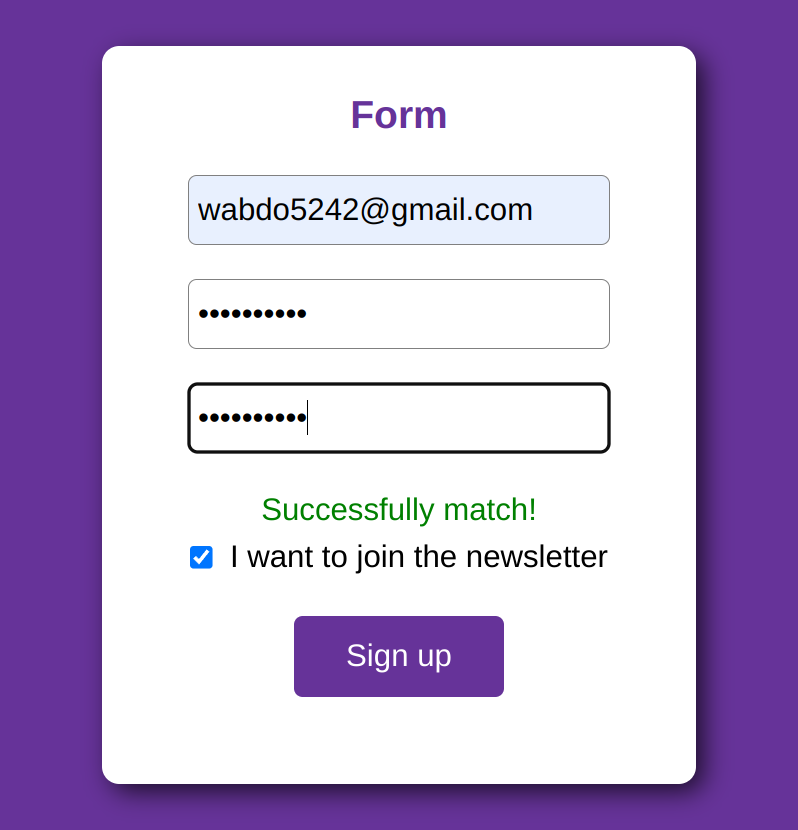

# 📝 Matching Password Form 


## Table of Contents

  

- [Table of Contents](#table-of-contents)

- [👋Introduction](#introduction)

- [🌟Features](#features)

- [🚀 Live Project](#-live-project)

- [📸 Screenshots](#-screenshots)

- [💡Technique Skills](#Technique-skills)

- [🛠️Technologies Used](#️technologies-used)

- [🏁Getting Started](#getting-started)

- [⬇️Installation](#️installation)

- [🔧Usage](#usage)

- [📄License](#license)

  

## 👋Introduction

  
"Matching Password Form" is allows users to enter their email, password, and confirm the password. The form checks if the passwords match and provides feedback to the user.


  

## 🌟Features

- Password Matching: The form checks if the password and confirm password fields match and provides visual feedback.
- Form Validation: Basic form validation to ensure that the password fields are not empty and match each other.
- State Management: Uses React's useState hook to manage the form data.
- Newsletter Signup: Includes a checkbox for users to sign up for a newsletter.
- Type Safety: Utilizes TypeScript for type safety in the form data and event handling.


## 🚀 Live project


[📝 Matching password Form ](https://matching-password-form.vercel.app)

  

## 📸 Screenshots

  





## 💡Technique Skills

- **TypeScript**
i used TypeScript for type safety
```
 const [formData, setFormData] = useState<{email:string,password:string,passwordConfirm:string,joinedNewsletter:boolean}>({
    email: "",
    password: "",
    passwordConfirm: "",
    joinedNewsletter: true,
  });


  function handleChange(event:React.ChangeEvent<HTMLInputElement>) {
    const { name, value, type, checked } = event.target;
    setFormData((prevFormData) => ({
      ...prevFormData,
      [name]: type === "checkbox" ? checked : value,
    }));
  }

  function handleSubmit(event:React.FormEvent<HTMLFormElement>) {
    event.preventDefault();
    if (formData.password === formData.passwordConfirm) {
      console.log("Successfully signed up");
    } else {
      console.log("Passwords do not match");
    }
```
- **JavaScript**
```
  let check =
    formData.password === formData.passwordConfirm &&
    formData.password.length !== 0;

```
- **Dom Rendering**
```
<p className={check ? "right" : "wrong"}>
            {check ? "Successfully match!" : "Passwords do not match"}
</p>

```

- **State Mangement**
```
  const [formData, setFormData] = useState<{email:string,password:string,passwordConfirm:string,joinedNewsletter:boolean}>({
    email: "",
    password: "",
    passwordConfirm: "",
    joinedNewsletter: true,
  });

```

## 🛠️Technologies Used

  

The Matching password Form project utilizes the following technologies:

  

-    &nbsp;  &nbsp;[Html](https://html.com/)

-    &nbsp;  &nbsp;[Css](https://www.w3.org/Style/CSS/Overview.en.html)

-    &nbsp;  &nbsp;[React](https://reactjs.org/)

-    &nbsp;  &nbsp;[TypeScript](https://www.typescriptlang.org/)


-    &nbsp;  &nbsp;[Tailwindcss](https://tailwindcss.com/)


## 🏁Getting Started

  

To set up the Matching password Form  project locally, follow the instructions below.

  

## ⬇️Installation

  

To set up the project locally, follow these steps:

  

1. Clone the repository:

  

```bash

git clone https://github.com/Abdelrahman-wahed/matching-password-form.git

```

  

2. Navigate to the project directory:

```bash

cd matching-password-form


```

  

3. Install the required dependencies:

  

```bash

npm install

```

  

## 🔧Usage

  

1. Run the development server:

  

```bash

npm run dev

```

  

2. Open your browser and go to `http://localhost:5173/` to view the application.

  

## License

  

This project is licensed under the MIT License - see the [LICENSE](LICENSE.md) file for details.
